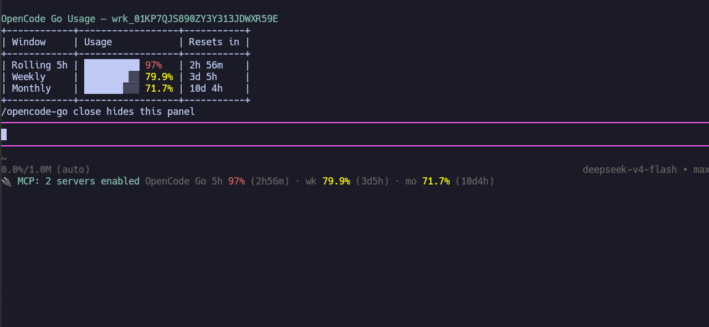
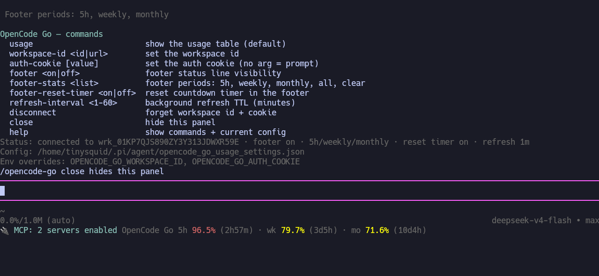

# @tinysquid/pi-opencode-go-usage

[](https://www.npmjs.com/package/@tinysquid/pi-opencode-go-usage)
[](https://github.com/TinySquid/pi-agent-extensions/blob/main/LICENSE)

Track your [OpenCode Go](https://opencode.ai/go) plan usage without leaving [pi](https://github.com/badlogic/pi-mono/tree/main/packages/coding-agent). The extension appends a status line to the built-in footer — rolling 5-hour, weekly, and monthly usage with optional reset countdowns — and provides an `/opencode-go` command that shows a full usage table on demand. Data comes from opencode.ai's console API, authenticated with your browser's `__Host-console_session` cookie and your workspace id.



## Install

```bash
pi install npm:@tinysquid/pi-opencode-go-usage
```

For local development, symlink the extension directory (multi-file extensions must be loaded as a directory, not a single file):

```bash
ln -sfn $(pwd)/opencode-go-usage ~/.pi/agent/extensions/opencode-go-usage
```

## Getting started

1. **Set your workspace id.** Copy it from the OpenCode Go dashboard URL (`https://opencode.ai/workspace/wrk_…/go`), then:

   ```
   /opencode-go workspace-id <id|url>
   ```

   A bare `wrk_…` id or the full URL both work — the id is extracted and validated.

2. **Set your session cookie.** In a browser logged in to opencode.ai, open DevTools → Application → Cookies and copy the value of the `__Host-console_session` cookie (an `st_…` string), then:

   ```
   /opencode-go session-cookie
   ```

   With no argument this opens an input dialog — the recommended path, since inline slash-command text is persisted to session history while dialog input is not. You can also pass the value as an argument; a bare `st_…` value, a `__Host-console_session=…` pair, or a full `Cookie:` header line are all accepted and normalized.

That's it — the footer appears immediately and refreshes in the background.

> [!IMPORTANT]
> The session cookie is a browser credential that grants access to your opencode.ai account. It is stored with `0600` permissions in pi's agent directory and should never be shared or committed. If it expires (or opencode.ai rotates the session), the footer tells you — just set a fresh one.

> [!NOTE]
> **Upgrading from 0.1.x?** opencode.ai replaced the dashboard page with an API, and the old `auth` cookie no longer works. Re-authenticate with `/opencode-go session-cookie` using the new `__Host-console_session` cookie value. The old `auth-cookie` subcommand name is kept as an alias, and existing configs are migrated in place.

## Commands

All commands live under `/opencode-go`; subcommands and values autocomplete as you type.

| Command                                     | Description                                                             |
| ------------------------------------------- | ----------------------------------------------------------------------- |
| `/opencode-go` (`usage`)                    | Force-fetch and show the usage table widget                             |
| `/opencode-go close`                        | Hide the usage/help panel                                               |
| `/opencode-go workspace-id <id\|url>`       | Set the workspace (org) id                                              |
| `/opencode-go session-cookie [value]`       | Set the session cookie (no arg = prompt)                                |
| `/opencode-go footer <on\|off>`             | Toggle footer status visibility                                         |
| `/opencode-go footer-stats <list>`          | Footer periods: `5h`, `weekly`, `monthly`, a comma list, `all`, `clear` |
| `/opencode-go footer-reset-timer <on\|off>` | Toggle reset countdown timers in the footer (default off)               |
| `/opencode-go refresh-interval <1-60>`      | Background refresh TTL in minutes (default 3)                           |
| `/opencode-go disconnect`                   | Forget workspace id + cookie (display settings kept)                    |
| `/opencode-go help`                         | Command list + current config as a widget                               |

The footer status line joins onto the built-in footer's extension-status line (the footer itself is never replaced):

```
OpenCode Go 5h 62% · wk 31% · mo 44%
OpenCode Go 5h 62% (1h12m) · wk 31% (3d4h) · mo 44% (12d0h)   ← with reset timers on
```

Percentages are colored by threshold: dim below 70%, warning at 70%+, error at 90%+.

## Configuration

Settings live in `~/.pi/agent/opencode_go_usage_settings.json`, created with defaults (mode `0600`) on first load. Every write is atomic (tmp + rename) at `0600`:

```json
{
  "workspaceId": "",
  "sessionCookie": "",
  "footerEnabled": true,
  "footerPeriods": ["5h", "weekly", "monthly"],
  "footerCountdowns": false,
  "refreshMinutes": 3
}
```

- **Env var overrides:** `OPENCODE_GO_WORKSPACE_ID` and `OPENCODE_GO_SESSION_COOKIE` take precedence over the file. Commands that save a field warn when a matching env var shadows it.
- **Invalid values** fall back to that field's default (never crash). `footerPeriods` accepts alias tokens (`5hr`, `wk`, `mo`, …) in any order and is stored canonically; an empty array is valid and hides all periods. `refreshMinutes` is clamped to 1–60.
- The file is the escape hatch — every setting is also managed by the commands above.



## Behavior notes

- **Background refresh:** a 30s timer fetches only when the cached data is older than the TTL; each `turn_end` always refreshes (usage just changed), and `/opencode-go usage` always fetches. Concurrent triggers share a single in-flight request. Session start renders the footer instantly from last known state and fetches without blocking startup.
- **Failures:** on fetch failure the footer keeps the last data with a `· stale` marker; if nothing was ever fetched it shows the error (e.g. `session expired — set a fresh one with /opencode-go session-cookie`). A 401/403, or a 200 response without meters, is reported as an expired/invalid session cookie.
- **Partial data:** a response missing a window (e.g. no `month` meter) simply omits that row. The API reports usage in microcents; the extension converts to percentages and never displays dollar amounts.
- **Print mode** (`pi -p`): `usage` and `help` print to stdout; UI-dependent features (footer, widgets, the cookie prompt) are inactive — pass the cookie as an argument instead.
- **API endpoint:** requests go to `https://opencode.ai/console/api/go/status` with the session cookie, an `x-org-id` header, and a 20s timeout.
